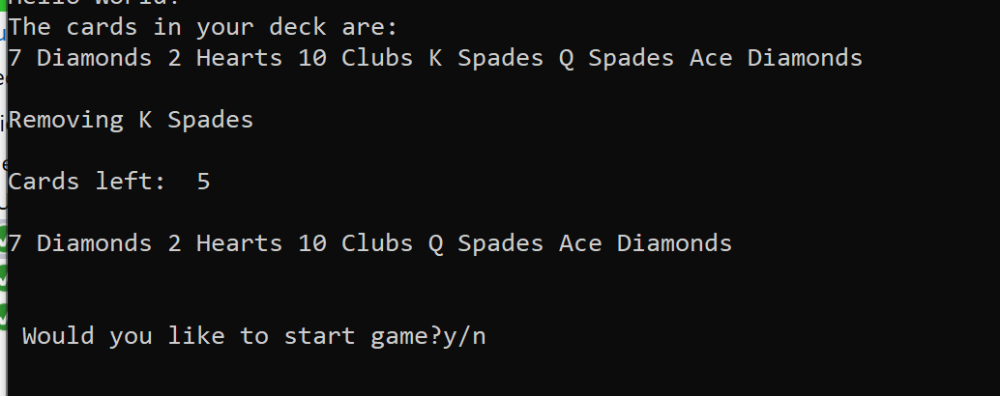
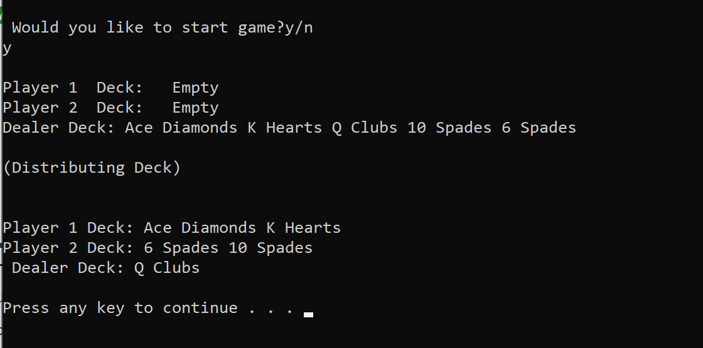

# lab07-Collections

This lab is to practice how to create collection and use it.

I create a custom generic collection named Deck<T>.

As we learned, under the hood, generic collections are arrays. Create a new generic collection (Deck<T>) that dynamically resizes an array.
Generic collection should hold Cards. 

I create a custom Card class which has two properties: cardNumber and suit

Create an Enum to hold the different card suits (Hearts, Diamonds, Spades, Clubs)

The methods within your Deck class are:

Add

Remove

Count (the total number of cards in the deck)

In your Program.cs have a method named Deal that gets called from Main that evenly distributes the deck of cards amongst 2 players decks.

The Dealer Deck should keeps any remaining cards (if any). Output to the console the cards each player has and what the Dealer Deck has kept.

Example output:

when you choose "y",it will display the output of deal();

